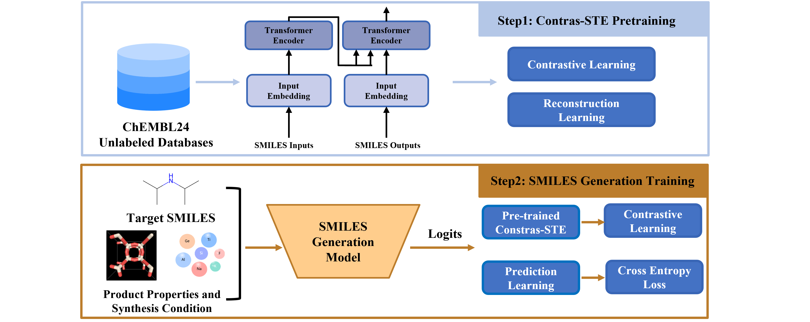

# Contras-STE: Contrastive Learning-based SMILES Transformer Encoder for Molecrlar Representation

**Paper Title:**
**Enhancing Conditional Molecular Generation with Pretrained SMILES Transformer and Contrastive Representation Learning**

line exhibit average F1-score improvements of 3.12, 0.64, and 1.53 across different tasks, demonstrating its substantial potential for NLP tasks within the zeolite research community.

## Pipeline Architecture



## Installation

### Requirements

* PyTorch (≥1.5.0)
* Transformers (tested on v3.0.2)
* tqdm (≥4.36.0)
* numpy (≥1.18.0)
* seqeval
* rdkit

Install dependencies via:

```bash
pip install torch transformers tqdm numpy seqeval rdkit
```

## Data and Pre-trained Models

### Datasets

Available on Kaggle:

* [Original Dataset for ZeolBERT](https://www.kaggle.com/datasets/boldhu/original-dataset-for-zeolbert)

### Pre-trained Models

Download and place the models in `./pretrained_model/bert-base-cased`:

* [Pre-trained Model and Fine-tuned Models](https://www.kaggle.com/datasets/boldhu/original-dataset-for-zeolbert)
